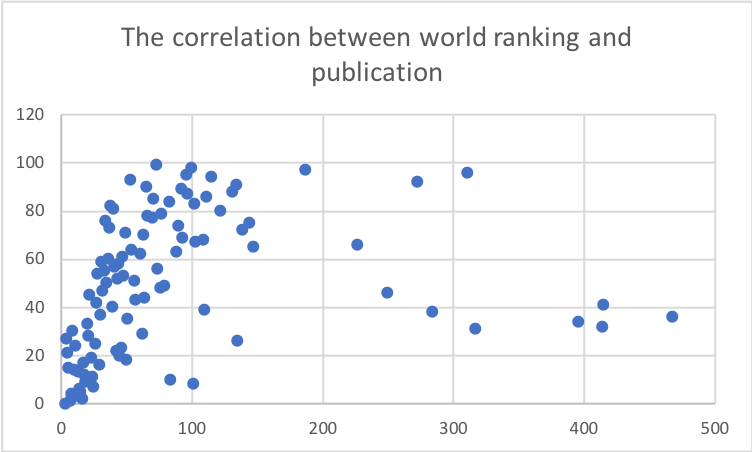
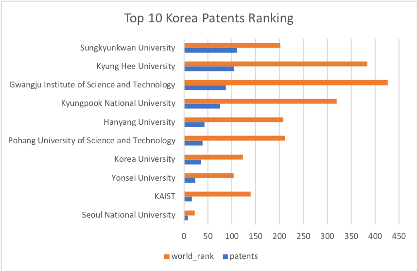

# Presentation

# Checkpoint3: World College Rankings

* Datasets: World college ranking


* These colleges are ranked by location, national rank, quality of education, alumni employee, quality of faculty, publications, influences, citations, board impact, and patents, then it calculate a final score for ranking. Every column are ranking except of the score.


* National Rank: basically order the final score for each colleges
* Quality of Education: it was calcualted from students' overall GPA from classes also for the future employment
* Alumni Employment: amount student who graduated from their old school and keep working there
* Quality of faculty: Based on teacher evaluation from students
* Publication: based on the sales volume from school's publication (book or research)
* influences: basically calcualte the amount of honorees and Distinguished Alumni
* Citation: It is just amount of citation
* Broad Impact: influence created by the board of directors
* Patent: The number of patent they created 
* Score: based on the ranking on the top


Business Question: From this dataset, we can answer what colleges is the best in UK or some other countries, we can also find out the colleges have score below maybe 60 or 70. We are able to rank influences from highest to lowest. 

1. -- Rank the quality_of_education from the highest to lowest in the US

For Q1, we are ranking the world rank (USA) based on quality of education (Ranking, not score) from highest to lowest. Firstly, the dataset gave us world and quality of education. After coding, we have our top 10 colleges ordered by quality of education ASC, the lower number they have, the higher rank they've got. And then we have school with first place ranks first (Quality of education) in the world, and school with 3rd place ranks second for the quality of education. 

```SQL
SELECT world_rank,quality_of_education
FROM datasets.world_college_ranking
WHERE location = 'USA'
ORDER BY quality_of_education ASC
```


2. -- Rank the world rank from the highest to lowest in UK

For Q2, we want to have our world rank for British schools ranked from highest to lowest. From the dataset, we still have world rank and we also have institution grouped. While ordering the world rank, we still did ASC. And then we have Cambridge ranked the 4th place, Oxford ranked the 5th place and other 8 British schools' ranking in the graph. 

```SQL
SELECT world_rank, institution
FROM datasets.world_college_ranking
WHERE location = 'United Kingdom'
ORDER BY world_rank ASC
```


3. -- The correlation between world ranking and publication

We are comparing publicaion and world rank for top 10 schools, and then we have Harvard rank both 1st place for publication and world rank, Stanford ranks the second for world and 5th for publication. Based on the data, they do have correlation between this two ranking but it is actually no that high based on the graph because CalTech ranks 11 in the world but 82 for the publication. And Univ of Virginia ranks 40 in the world but 108 for the publication

```SQL
SELECT publications, institution, world_rank
FROM datasets.world_college_ranking
GROUP BY publications, institution, world_rank
ORDER BY world_rank ASC
```



4. -- The correlation between world ranking and citation

For Q4, we found out there is also strong correlation between world ranking and citation rank. We have Harvard again taking 1st place for both, and then we have UCLA ranks 15th in the world and 9th for citation. NYU ranks 19th in the world and 32nd for citation. 

```SQL
SELECT institution, world_rank, citations
FROM datasets.world_college_ranking
GROUP BY institution, world_rank, citations
ORDER BY citations DESC
```


5.-- -- South Korea world ranking vs patents ranking

Korea Schools have excellent technoloy innovation although the world ranks are not that competitive with the United States but SK is the best on technology currently. 

```SQL
SELECT institution, patents, world_rank
FROM datasets.world_college_ranking
WHERE location = 'South Korea' 
ORDER BY patents DESC
```




6. -- What regions have the high density of the top 1000 university in the world?

We are looking for which countries have the most number of school from the dataset. After coding, North America (US and Canada) has the most number of colleges, and then is west Europe (Britian, Germany, and France etc). East Asia ranked the third place (China, Japan, Korea atc.)

```SQL
SELECT location,
count(location) as c_location
FROM datasets.world_college_ranking
group BY location
ORDER BY c_location DESC
```


7. -- What countries are prominent in top 10 universities in the world?

For Q7, we are looking for what countries have schools ranked top 10, then we have USA and UK on top 10. 

```SQL
SELECT institution, location, world_rank
FROM datasets.world_college_ranking
WHERE world_rank < '10'
ORDER BY world_rank ASC
```


8. -- What is the rank of influence in South Korea

We want to know the influence rank in South Korea. From the dataset, we firstly have to find out our main location, which is Korea. Then we must order influence ASC. For the result, we have Seoul National Univ ranks 159 and Sungkyunkwan Univ ranks 299 for the influence. Basically, the top 10 schools on graph have the first 2 schools on average. 

```SQL
SELECT institution, influence, location
FROM datasets.world_college_ranking
WHERE location = 'South Korea'
ORDER BY influence ASC
```


9. -- What is the influence rank for Japan between 100 to 309

We tried to find out Japanese school with influence rank between 100 to 309, we still point out the location first then we selece the influence rank between 100 to 309 from the dataset. After coding, we will have Tohoku Univ ranks 152 and Nagoya Univ places 163 and other 8 schools.

```SQL
SELECT institution, location, influence
FROM datasets.world_college_ranking
WHERE location = 'Japan' and influence between '100' and '309' 
ORDER BY influence DESC
```


10. -- How many different countries make up the top 100 universities?

Firstly, the dataset gives us the location and we are trying to find out what countires does the top 100 univ include. We count location again but this time we do n_location. We set the world rank between 1 and 100. Afterward, we order the n_location desc. As a result, we still have USA with 54 colleges and then we have UK with 7 schools, and we just have few Asian school rank top 100. 

```SQL
SELECT location,
count(location) as n_location
FROM datasets.world_college_ranking
WHERE world_rank between '1' and '100'
group BY location
ORDER BY n_location DESC
```


